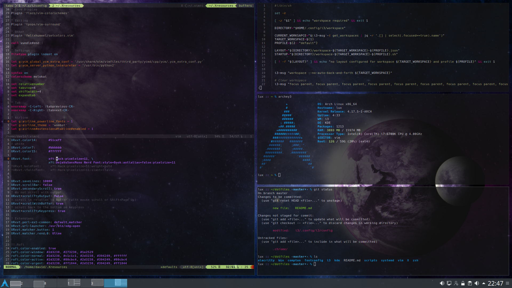

dotfiles
========




## Introduction

Most toplevel folders contain configuration that can be installed using
[GNU stow](https://www.gnu.org/software/stow/manual/stow.html) when cloned to `~/dotfiles`.

These dotfiles are not meant to be just cloned and installed, even though it is
possible you're probably realize pretty quickly that variables and configuration
are made to work for me and my system(s). So use them as a help and guideline,
don't blindly copy and paste.

If you wanna talk to me, you can find me on Freenode.

### Dependencies

A random list of dependencies, not all are required, just pick what you want.

* KDE/Plasma
* i3(-gaps)
* compton
* nitrogen
* wmctrl
* zsh
* urxvt / alacritty
* Hack and `Dejavu Sans Mono Nerd Font Complete`
* vim (e.g. Vundle)


## Desktop

The desktop currently consists of KDE as DE with i3-gaps as a tiling window manager.

### Plasma and i3

To replace KWin with i3 the [`kde/.config/plasma-workspace/env/wm.sh`](kde/.config/plasma-workspace/env/wm.sh)
sets the `KDEWM` environment variable.

Make sure to disable the Plasma Splash-Screen `System settings → Workspace Theme → Splash Screen`,
or remove/rename `/usr/bin/ksplashqml`. While you're already in the settings I recommend
unbinding all Plasma keybinds.

The rest is done within the [`i3/.config/i3/config`](i3/.config/i3/config) configuration.
Killing Plasma desktop:

```
exec --no-startup-id wmctrl -c Plasma
for_window [title="Desktop — Plasma"] kill
```

And re-enabling compositing (optional):

```
exec compton -fb --backend glx --vsync opengl
```

## Themes

KDE/Qt and Gnome/GTK themes are all set to either Breeze or Breeze-Dark.
The Icon theme is a custom ArchLinux cursor theme.

### Wallpapers

Wallpapers are restored using `nitrogen --restore` and can be manuall configured using
[`nitrogen`](http://projects.l3ib.org/nitrogen/).

## Applications

### Launcher

The launcher is `rofi` with a very simple configuration/theme configured in
[`X/.Xresources`](X/.Xresources). Alternatively you can still use the Plasma
application runner using `Alt+F2`.

### Terminal

I started out with configuring Alacritty for a terminal emulator (the configuration
is still there), it works fine but I was missing scrollback and minor things like
klickable links. But people are already actively working on scrollback, so once
that is done I might consider going back.

For now I am using URxvt (which when run in server/client mode is even faster than
Alacritty for me, even though Alacritty claims it is the fastest). The configuration
is rather minimal and can be found in [`X/.Xresources`](X/.Xresources), it was a
bit of a pita to get the font rendering to work (having Hack as a font with
all required glyphs for powerline/airline).

The color scheme is a slightely modified molokai scheme.

### Zsh

The shell of my choice is zsh with `oh-my-zsh` as a configuration basis and
plugin/theme manager. The configuration is rather straight forward and can be found
in [`zsh/.zshrc`](zsh/.zshrc).

### Vim

The main vim setup is done through Vundle only YCM and Vundle itself are installed
by the system package manager.

Color scheme is again molokai, the rest of the configuration lives in
[`vim/.vimrc`](vim/.vimrc).


## Other

### Keepass ssh-agent

The environment is being setup to have your ssh keys managed by Keepass,
which populates the ssh-agent with its keys as long as it is unlocked.
This is done in [`kde/.config/plasma-workspace/env/vars.sh`](kde/.config/plasma-workspace/env/vars.sh)
in combination with a systemd service
[`systemd/.config/systemd/user/ssh-agent.service`](systemd/.config/systemd/user/ssh-agent.service).

Now [Keeagent](https://github.com/dlech/KeeAgent) can operate in client mode.

### ws

[`bin/.local/bin/ws`](bin/.local/bin/ws) is a small utility script meant to be started
through rofi or a keybind to populate an entire workspace with windows and a predefined
layout.

It expects the desired workspace as first argument and optionally a profile as second
then looks for the i3 layout file in
`~/.config/i3/workspace/workspace-${WORKSPACE}-${PROFILE:-default}.json` and applies it
to `${WORKSPACE}` afterwards it launches the file
`~/.config/i3/workspace/workspace-${WORKSPACE}-${PROFILE:-default}.sh` which can be
used to populate the newly created workspace/layout.

## Chrome Extensions

[`.chrome`] contains custom Chrome/Chromium extensions, these can be installed via
the Chrome extension manager as an unpacked extension.

Currently the only purpose of these extensions is to make web applications better
integrate with the system.

